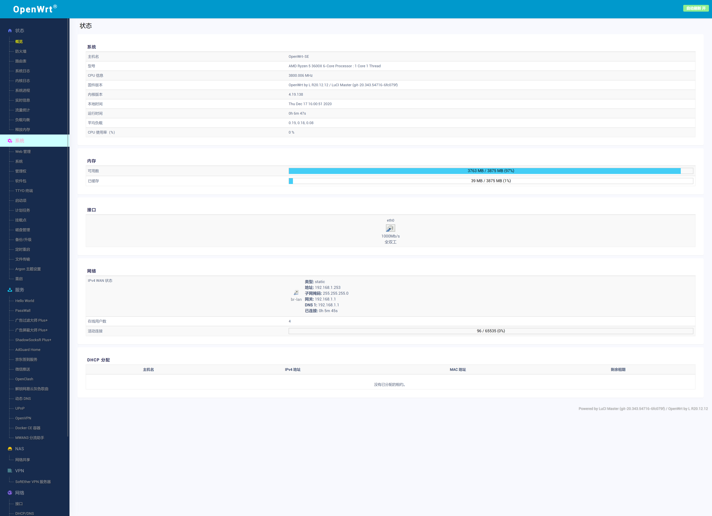
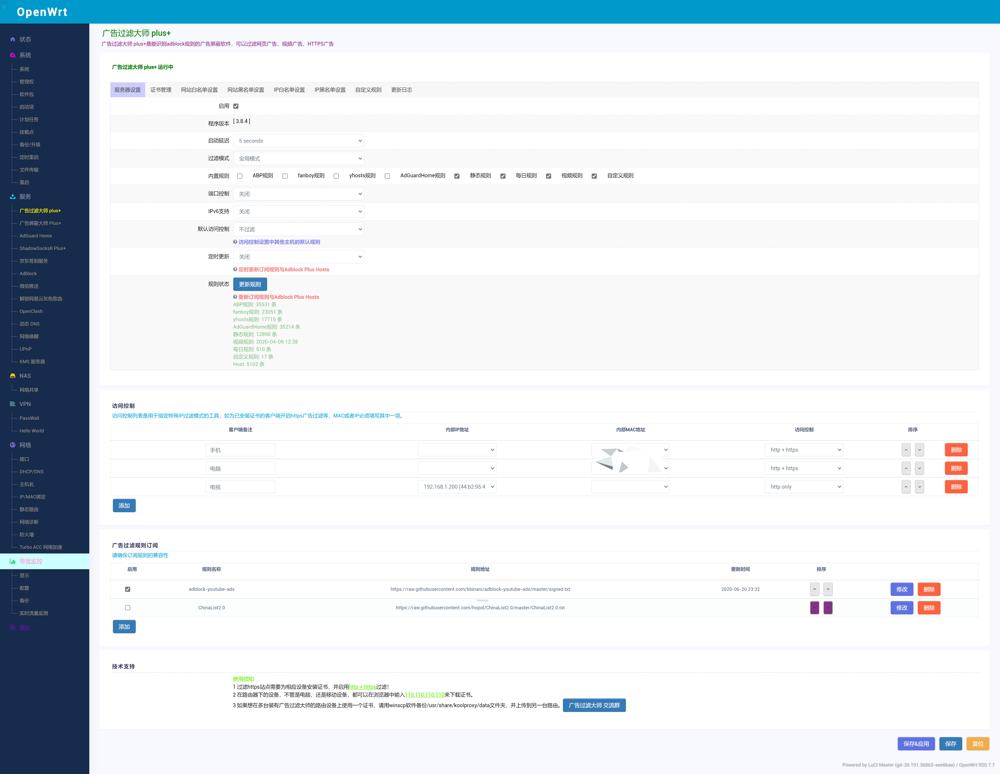
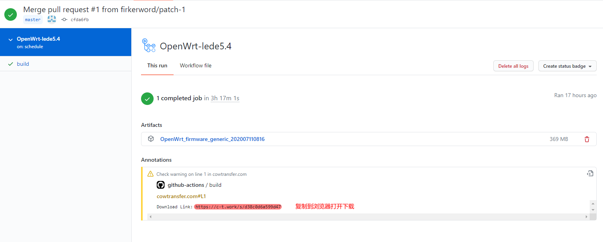

# lede大openwrt-X86-64追新版 & P3TERX大opwnert云编译脚本

云编译脚本地址：[https://github.com/P3TERX/Actions-OpenWrt](https://github.com/P3TERX/Actions-OpenWrt)

固件源码地址：[https://github.com/coolsnowwolf/lede](https://github.com/coolsnowwolf/lede)

lean最新源码版本，内核为***5.4***版和***4.19***版

自动每3天更新一次，手动不定时更新

> `ip：192.168.1.1 密码：password`

稳定版云编译项目：[https://github.com/firkerword/openwrt-stable-version](https://github.com/firkerword/openwrt-stable-version)

感谢各位大佬的源码。

## 固件截图：
4.19版

5.4版

## 下载方式：点击[Actions](https://github.com/firker/openwrt-Exclusive/actions)  选择需要的版本

## 联系[tg频道订阅](https://t.me/zhinengchaoshenzhe)

如果你觉得我的努力对你有所帮助，可以请我喝杯饮料，我会更加努力做到更好，谢谢！
### 微信（Wechat）

